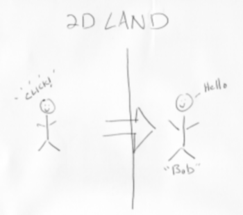
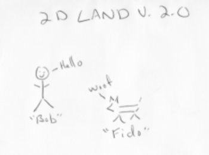

# Python设计模式

## 3种类型：
	 1. 创建型
		*灵活方式创建对象*
			 - 抽象工厂
			 - 建造者
			 - 工厂方法
			 - 原型
			 - 单例
	 2. 结构型
		 *将一种对象改装为另一种对象，或将小对象合成大对象*
			 - 适配器
			 - 桥接
			 - 组合
			 - 修饰器
			 - 外观
			 - 享元
			 - 代理
	 3. 行为型
		 *关注做事过程，算法及对象间的交互*
			 - 责任链
			 - 命令
			 - 解释器
			 - 迭代器
			 - 中介者
			 - 备忘录
			 - 观察者
			 - 状态
			 - 策略
			 - 模板方法
			 - 访问者

## 适配器模式 Adapter Pattern

**概念：**

		是一种接口适配技术，可通过某个类来使用另一个接口与之不兼容的类。
		使用时，两个类的接口都无须改动。

**场景：**

		把某个类从其原先的应用场景中拿出来放在另一个环境中运行，而这个类又不能修改。
			
**示例：**

1. 创建一个人，点击他会显示名字，说话。

	class Person(object):
	    """A representation of a person in 2D Land"""
	    def __init__(self, name):
	        self.name = name
	    def make_noise(self):
	        return "hello"

       
	def click_creature(creature):
	    """React to a click by retrieving the creature's
	    name and what is says
	    """
	    return creature.name, creature.make_noise()

2. 创建一只狗

	

	class Dog(object):
		"""A representation of a dog in 2D Land"""
		def __init__(self, name):
			self.name = name
		def bark(self):
		    return "woof"

狗只有bark，没有make_noise，需要适配。

 - the Class Adapter 
 - the Object Adapter

#### *the Class Adapter* 

	from dog import Dog
	class Creature(object):
	    """The base class for creatures in 2D Land"""
	    def make_noise(self):
	        """
	        This is a technique to fake an ABC
	        in Python 2.X
	        """
	        raise NotImplementedError
	
	class Person(Creature):
	    """A representation of a person in 2D Land"""
	    def __init__(self, name):
	        self.name = name
	
	    def make_noise(self):
	        return "hello"
	
	class DogClassAdapter(Creature, Dog):
	    """Adapts the Dog class through multiple inheritance"""
	    def __init__(self, name):
	        Dog.__init__(self, name)
	
	    def make_noise(self):
	        """
	        Provide the 'make_noise' method that
	        the client expects
	        """
	        return self.bark()

#### *the Object Adapter* 
	class DogObjectAdapter(Creature):
		"""Adapts the Dog class through encapsulation"""
		def __init__(self, canine):
		    self.canine = canine
		def make_noise(self):
	        """This is the only method that's adapted"""
	        return self.canine.bark()		
	    def __getattr__(self, attr):
		    """Everything else is delegated to the object"""
		    return getattr(self.canine, attr)
	

#### *Simple *

	from dog import Dog
	class Person(object):
	    """A representation of a person in 2D Land"""
	    def __init__(self, name):
	        self.name = name
	
	    def make_noise(self):
	        return "hello"
	
	class DogAdapter(object):
	    """Adapts the Dog class through encapsulation"""
	    def __init__(self, canine):
	        self.canine = canine
	
	    def make_noise(self):
	        """This is the only method that's adapted"""
	        return self.canine.bark()
	
	    def __getattr__(self, attr):
	        """Everything else is delegated to the object"""
	        return getattr(self.canine, attr)
	
	def click_creature(creature):
	    """
	    React to a click by showing the creature's
	    name and what is says
	    """
	
	    return (creature.name, creature.make_noise())

#### *Test*

	from dog import Dog
	from listing3 import Person, DogAdapter
	def exercise_system():
	    person = Person("Bob")
	    canine = DogAdapter(Dog("Fido"))
	
	    for critter in (person, canine):
	
	        print critter.name, "says", critter.make_noise()
	
	if __name__ == "__main__":
	    exercise_system()

3. 创建更多的生物，猫，鸟...

#### 
		
	class Cat(object):
		"""A representation of a cat in 2D Land"""
		def __init__(self, name):
			self.name = name
		def meow(self):
			return "meow"
	
	
	class CreatureAdapter(object):
		"""Adapts a creature for clients in 2D Land"""
		def __init__(self, creature, make_noise):
			"""Pass in the function to use as 'make_noise'"""
			self.creature = creature
			self.make_noise = make_noise
		def __getattr__(self, attr):
			"""Everything else is delegated to the object"""
			return getattr(self.creature, attr)
	
#### *Test*
	from dog import Dog
	from cat import Cat
	from twodeeland import Person, CreatureAdapter
	def exercise_system():
		person = Person("Bob")
		fido = Dog("Fido")
		canine = CreatureAdapter(fido, fido.bark)
		whiskers = Cat("Whiskers")
		feline = CreatureAdapter(whiskers, whiskers.meow)
	
		for critter in (person, canine, feline):
			print critter.name, "says", critter.make_noise
